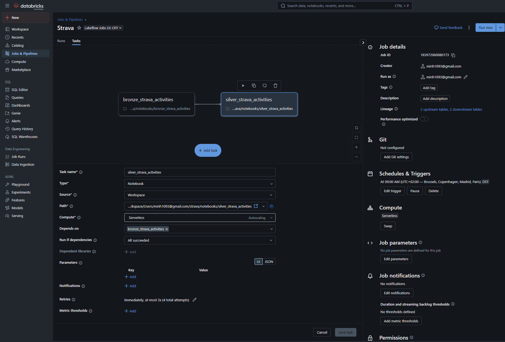
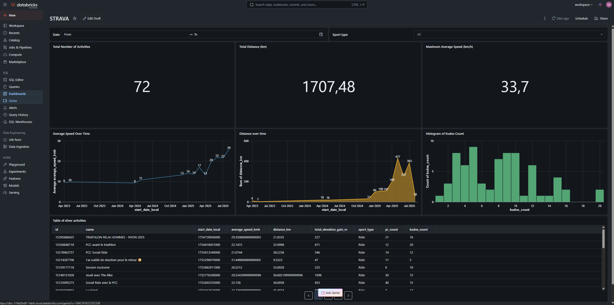

# Strava Activities Pipeline on Databricks

This project connects to the Strava API, retrieves the authenticated athlete's activities, stores them securely in Databricks using Secrets, and processes them into Bronze/Silver Delta tables for analysis.

## 🚀 Features
- **OAuth2 Authentication with Strava**
- Automatic token refresh using the `refresh_token`
- Retrieval of recent activities via the [Strava API](https://developers.strava.com/docs/reference/)
- Secure storage of sensitive credentials in Databricks Secrets
- Raw ingestion into **Bronze** table
- Cleaned and transformed data into **Silver** table with proper schema
- Ready for BI dashboards and analytics


## 📦 Requirements
- **Databricks Runtime 14.x** (Spark 3.x)
- Python 3.10+
- [stravalib](https://github.com/hozn/stravalib) Python library
- A registered Strava application ([instructions here](https://www.strava.com/settings/api))

## 🔑 Setup

### 1. Create Strava Application
1. Go to [Strava API Settings](https://www.strava.com/settings/api)
2. Create a new application
3. Note down:
   - `client_id`
   - `client_secret`
   - Set a `redirect_uri` (e.g., `http://localhost/exchange_token`)

### 2. Generate Initial Tokens
1. Authorize your app: https://www.strava.com/oauth/authorize?client_id=YOUR_CLIENT_ID&response_type=code&redirect_uri=YOUR_REDIRECT_URI&scope=read,activity:read_all&approval_prompt=force

2. Exchange the `code` received for tokens:
```bash
curl -X POST "https://www.strava.com/oauth/token" \
  -H "Content-Type: application/x-www-form-urlencoded" \
  -d "client_id=YOUR_CLIENT_ID" \
  -d "client_secret=YOUR_CLIENT_SECRET" \
  -d "code=THE_CODE_YOU_RECEIVED" \
  -d "grant_type=authorization_code"
```
You will get:
```
{
  "access_token": "...",
  "refresh_token": "...",
  "expires_at": 1234567890
}
```

### 3. Store Tokens in Databricks Secrets
```
dbutils.secrets.put(scope="strava", key="client_secret", string_value="...")
dbutils.secrets.put(scope="strava", key="access_token", string_value="...")
dbutils.secrets.put(scope="strava", key="refresh_token", string_value="...")
dbutils.secrets.put(scope="strava", key="expires_at", string_value="1234567890")
```

### 4. Create Job



To automate the data ingestion and transformation, create a **Databricks Job** that runs both the ingestion (Python) and transformation (SQL) notebooks in sequence.

**Steps:**
1. In Databricks, go to **Workflows → Jobs → Create Job**.
2. **Add the first task**:
   - Name: `bronze_strava_activities`
   - Type: Notebook
   - Path: `notebooks/bronze_strava_activities.py`
   - Cluster: Select an existing cluster or create a new one.
3. **Add a second task**:
   - Name: `silver_strava_activities`
   - Type: Notebook
   - Path: `notebooks/silver_strava_activities.sql`
   - Set it to run **after** the first task.
4. Configure the schedule (e.g., daily at 6 AM).
5. Save and run the job.

This ensures the pipeline fetches the latest Strava activities and updates the Silver table automatically.

---

### 5. Create Dashboards



Once the Silver table is ready, you can create dashboards for analysis.

**Option 1 — Databricks SQL Dashboards**
1. Go to **SQL → Queries** in Databricks.
2. Write queries against `workspace.strava.silver_activities` (e.g., average speed trends, weekly distance).
3. Save queries and add them to a **Dashboard**.
4. Configure auto-refresh (e.g., every 15 minutes) to display updated data from the scheduled job.

**Option 2 — External BI Tools**
You can connect Databricks to external BI tools:
- **Tableau**: Connect using the Databricks Connector.
- **Power BI**: Use the built-in Databricks connector or JDBC/ODBC.
- **Looker / Superset**: Connect via JDBC.
  
In all cases:
- Use the Silver table as your data source (`workspace.strava.silver_activities`).
- Create visuals such as:
  - Total distance by month
  - Average speed by sport type
  - Cumulative elevation gain over time
  - PR count and kudos trends

This will give you an interactive view of your Strava performance over time.